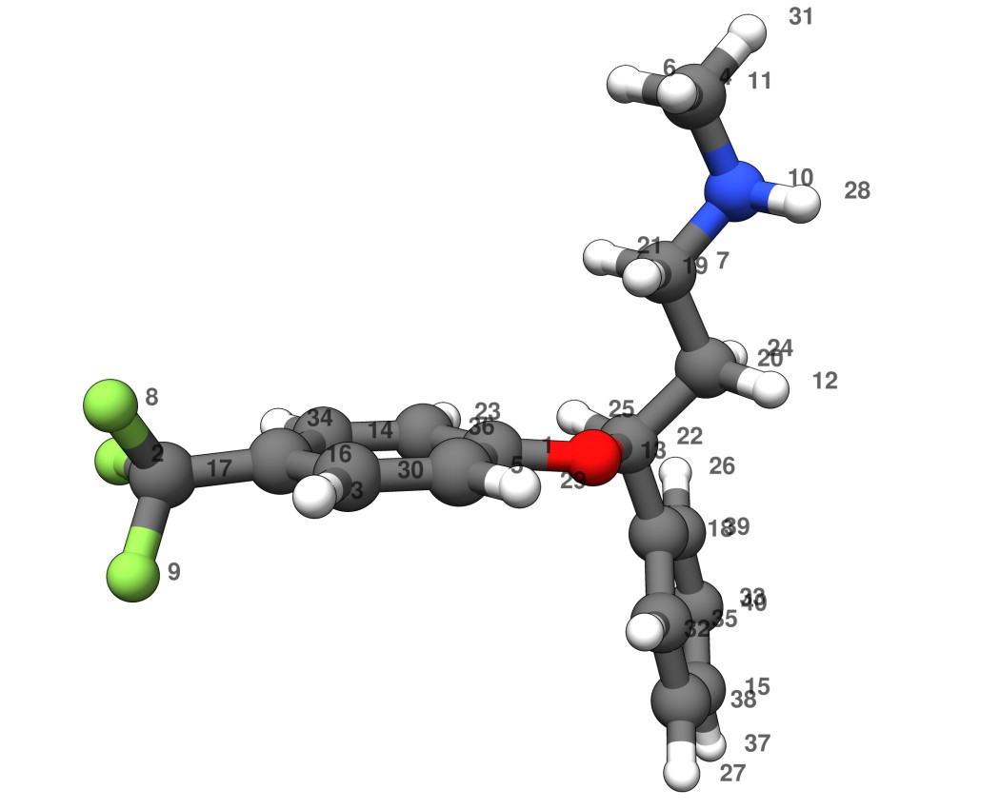
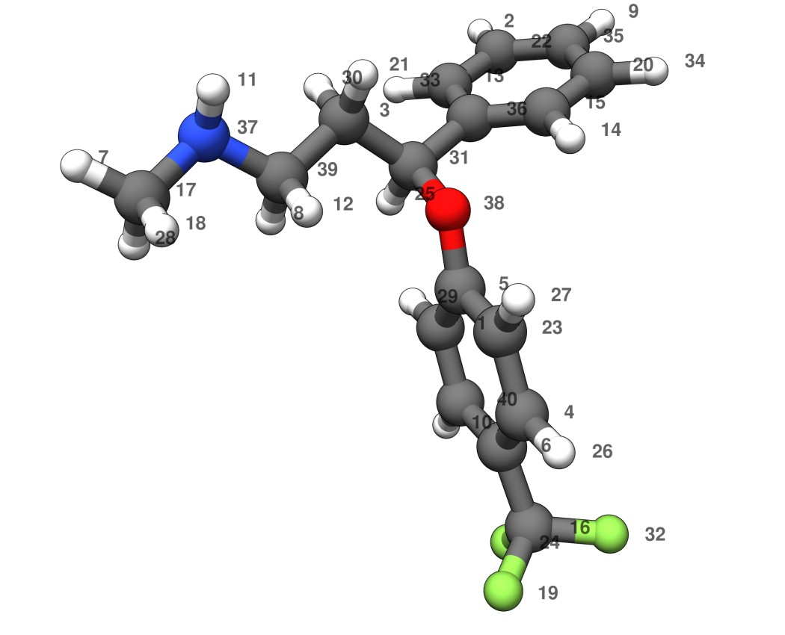
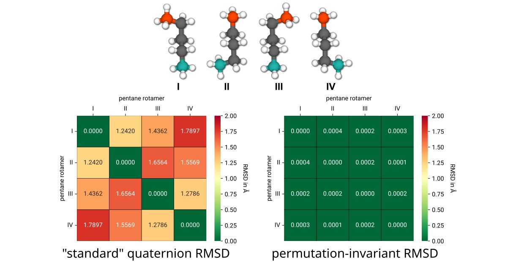
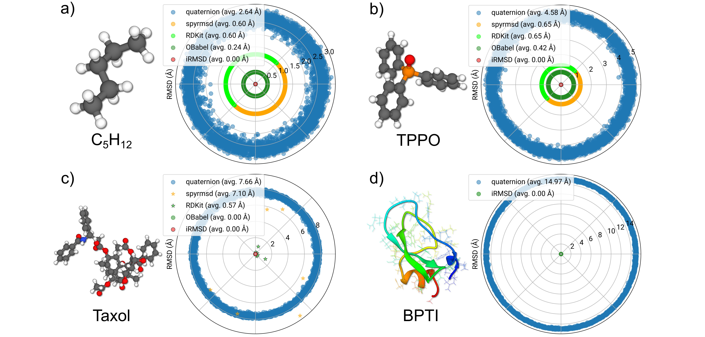
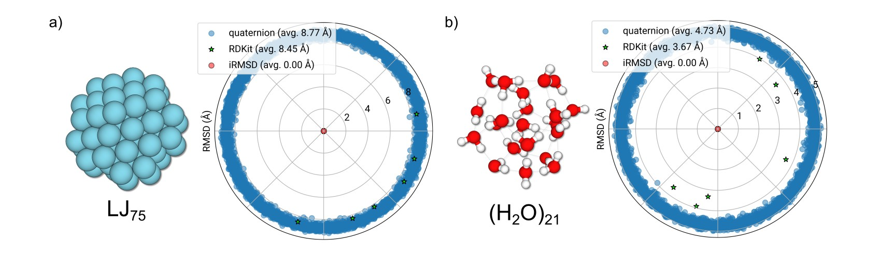
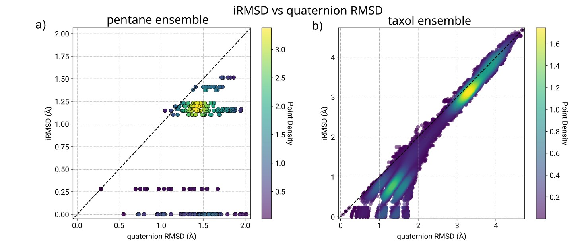

<div align="center"> 


<h1>iRMSD</h1>
<h3><em>Molecular Structure Comparison and Ensemble Pruning</em></h3>

[](https://github.com/pprcht/irmsd/releases/latest)
[](http://dx.doi.org/10.1021/acs.jcim.4c02143)
[](https://www.gnu.org/licenses/lgpl-3.0) 
<!--  -->

</div>


---

## iRMSD Package 📦

**iRMSD** is a utility toolkit for *molecular structure comparison*, *ensemble pruning*, and *symmetry-aware RMSD analysis*.
It combines a clean **Python API** with an optimized **Fortran backend**, providing fast and robust routines for large conformational ensembles and multiscale computational workflows.

The package offers:

*  *Fast RMSD evaluation* including symmetry handling, canonicalization, and optimal superposition
* *Structure grouping and pruning* based on distance thresholds or iRMSD criteria
* *Flexible Molecule class* with XYZ/extXYZ parsing and ASE interoperability
* *Low- and high-level APIs* that expose direct Fortran wrappers as well as convenient Python abstractions
* *Extendable infrastructure* for future shape metrics and ensemble workflows

iRMSD is designed for researchers working in computational chemistry, conformational sampling, machine learning for molecules, and structural bio/chem-informatics, and integrates seamlessly with tools such as **ASE**, **RDKit**, **CREST/xTB**, or custom multiscale simulation pipelines.


## Installation 🔧

iRMSD is available via both **PyPI** and **conda-forge**.

**PyPI:**

```bash
pip install irmsd
```

**Conda:**

```bash
conda install -c conda-forge irmsd
```


For basic usage instructions, both via the CLI and in-code, [**see below**](#when-and-how-to-use-irmsd).


<br>
<br>

# Scientific Background 🔬 
[](http://dx.doi.org/10.1021/acs.jcim.4c02143) 

Structural comparison is at the heart of conformational analysis, docking, trajectory processing, and molecular shape workflows. However, the *classical* Cartesian RMSD fails whenever two structures differ by atom ordering, local symmetry, or rotameric permutations. In such cases, the RMSD becomes artificially large even though the molecular properties (e.g. IR/Raman spectra, NMR shifts, energies) are identical. 

The **permutation invariant RMSD (iRMSD)** implemented in this package solves this problem by:

- Assigning **canonical atom identities** independent of input atom order
- Performing **symmetry-aware alignment** using a divide-and-conquer approach
- Solving the **linear sum assignment problem (LSAP, Hungarian algorithm)** efficiently in Fortran
- Handling **false enantiomers** when appropriate
- Using **cached memory + single precision LSAP kernel** for high speed

Together, these yield a robust, fast, and scalable measure of structural similarity suitable for large ensembles (thousands of conformers), proteins, and noncovalent clusters.

Herein, the RMSD with optimal alignment and permutation is defined as:

```math
\mathrm{iRMSD}(\mathbf{X}, \mathbf{Y}) = \min_{\mathbf{P},\mathbf{U}} \sqrt{ \frac{1}{N} \sum_{i=1}^{N} \left\lVert \mathbf{X}_i - (\mathbf{P}\mathbf{U}\mathbf{Y})_i \right\rVert^2 }
```

where
* **X**/**Y** : Cartesian coordinates of the two molecules to be compared
* **U**: rotation matrix
* **P**: permutation matrix representing atom–atom assignment
* The minimization ensures best superposition *and* best atom correspondence

Details on the iRMSD method are extensively discussed in [***J. Chem. Inf. Model.* **2025**, *65* (9), 4501–4511**](https://pubs.acs.org/doi/abs/10.1021/acs.jcim.4c02143) (publically accessible preprint PDF → [**here**](https://doi.org/10.26434/chemrxiv-2024-qmcz4)).

<br>

A simple application example is seen below. Here, we have two copies of the same conformer of a drug molecule. Both have entirely random atom order, and are randomly rotated, as seen in the side-by-side coordinate blocks. iRMSD is capable of aligning the structures (i.e., determine **U**) and restoring the correct atom order (i.e., determine **P**).

<table>
  <tr>
  <td >

<p align="center">
  
</p>

   ```
   40

C       -0.01987163       0.21585450       0.53084229
F       -5.02463830      -0.24646228       0.55935722
H       -2.02078596       0.07612714       3.28881405
H        2.02217107       5.03032049       0.48927133
C       -0.40321997       0.20036704       1.87489113
H        1.45420890       5.18901427      -1.19371547
C        2.17733833       2.66864582      -0.76268897
F       -4.67751877       0.82944620       2.41720231
F       -4.36672604      -1.32184164       2.32896140
N        3.05552607       3.82905962      -0.92334538
C        2.33719322       5.04674518      -0.56018219
H        3.70511862       1.19476594      -0.34348568
O        1.33057234       0.20761810       0.33646497
C       -2.35768371       0.13869000      -0.09508508
C        3.33675576      -3.74750034      -2.09446622
C       -2.74269982       0.04812179       1.24847416
C       -4.18552434      -0.16594973       1.62929095
C        2.46510694      -1.17503088      -1.33196962
H        1.79066092       2.65122477       0.26603672
C        2.89633035       1.34737137      -1.06798449
H        1.32035063       2.77529913      -1.44056976
C        1.88069391       0.19085596      -0.99054876
H       -0.78657354       0.26628333      -1.51013041
H        3.35277236       1.39254113      -2.06515939
H        1.12828446       0.39627859      -1.75415357
H        2.85290238      -0.65540250      -3.39999372
H        2.95472656      -4.31081052      -0.05306773
H        3.86264326       3.72503009      -0.30378434
H        0.35812587       0.22941766       2.65225391
C       -1.75119800       0.11650566       2.23458197
H        2.98864128       5.91460759      -0.70023613
H        2.19806826      -2.07238586       0.62783765
H        3.61939256      -2.90096167      -4.05301199
H       -3.10849602       0.11742007      -0.88451613
C        2.51626740      -2.22605411      -0.40151847
C       -1.00752799       0.22167753      -0.45082349
H        3.65020338      -4.74303245      -2.39363218
C        2.94335708      -3.50256427      -0.78117933
C        2.88629837      -1.43730500      -2.64753502
C        3.31583545      -2.71173570      -3.02569967
   ```

  </td><td>

<p align="center">
   
</p>

   ```
   40

C       -0.24704090      -1.01437504      -0.42131871
H        0.08281196       4.25648110      -4.45174101
C       -2.11932720       2.61781842       0.01445529
C        1.20899262      -1.82043595       1.81603259
C        0.06190045      -0.08045642       0.56433738
C        0.96325609      -2.74361258       0.79254870
H       -5.94318235       1.81171553       2.40855988
H       -3.29334088       0.80998500       0.13668371
H        2.45550716       4.58283581      -3.81023846
H       -0.03284719      -3.03840102      -1.10722359
H       -3.98561760       3.07772980       1.87898342
H       -2.46402973       1.23328206       1.64736387
C       -0.42557689       3.20374316      -2.63835549
H        1.75819318       2.53315188      -0.11120094
C        1.36401460       2.91213412      -1.05217616
C        1.55024853      -4.13062528       0.85755848
C       -5.02082585       1.33577106       2.06226491
H       -4.46954169       0.99207120       2.94477135
F        1.12537189      -4.83404752       1.94307811
C        2.23386967       3.59149971      -1.91115269
H       -1.77441710       3.41406760       0.68479077
C        0.44278317       3.88505195      -3.49477440
C        0.75999111      -0.50199863       1.69951785
F        1.25250628      -4.89901106      -0.22700852
H       -1.33602978       1.09312678      -1.23580562
H        1.77634708      -2.11513027       2.69749589
H        0.97850985       0.21068905       2.49268249
H       -5.30292779       0.46548036       1.45870976
H       -0.81291545      -0.76799726      -1.31127696
H       -2.69322590       3.09272084      -0.79167457
C       -0.91816948       1.84289748      -0.56153015
F        2.91122354      -4.11008178       0.93361023
H       -1.45194769       3.04703738      -2.95566792
H        3.27528235       3.73258624      -1.62991966
C        1.77551163       4.07214665      -3.13522992
C        0.02303033       2.69241111      -1.40782985
N       -4.23963014       2.28871248       1.27977938
O       -0.23030633       1.25222222       0.55284285
C       -3.01762671       1.64629297       0.79234818
C        0.19969720      -2.33497332      -0.30817072
   ```       

  </td>
  </tr>
</table>

<br>
<br>

##  Examples  📊

### Example 1 - Symmetric Rotamers (Pentane C<sub>5</sub>H<sub>12</sub>)

<p align="center">
  
</p>

Most pentane conformers have *four* rotamers that differ only by permutation or inversion of terminal methyl groups.
As shown in Figure 3 of the paper (page 3) :

* Conventional RMSD between these rotamers ranges from 1.2-1.8 Å
* iRMSD correctly identifies all as identical (≈ 0.0 Å) by accounting for permutations and false enantiomers
* Property calculations (IR spectra, NMR shifts) also confirm they are physically equivalent

This simple example illustrates a key problem with classical (quaternion) RMSD-based conformer comparison and the necessity of addressing *both* the alignment *and* permutation problems for chemical workflows.

<br>

### Example 2 - Validation on Randomized Atom Order Structures

<p align="center">
   
</p>

A robust permutation-handling alignment algorithm must correctly classify structures as identical even if:

* randomly rotated
* atom order is randomly permuted
* (optional) mirrored ("*false enantiomers*")

Figures 7a–d (pages 6–7) show that iRMSD successfully returns ~0 Å for **every pair** in 100 randomized input coordinates of: pentane (12 atoms), TPPO (46 atoms), taxol (113 atoms), BPTI (892 atoms).


<br>

### Example 3 - Noncovalent Clusters (LJ<sub>75</sub> and (H<sub>2</sub>O)<sub>21</sub>)


<p align="center">
  
</p>

Noncovalent clusters break most RMSD algorithms because:

* the molecular graph is *disconnected*
* atom types are all identical (e.g., LJ<sub>75</sub>)
* graph-isomorphism methods become impossible

iRMSD handles these correctly because:

* canonical atom identity assignment does **not** require a connected graph and automatically falls back to the atom types
* LSAP efficiently handles the remaining permutation

For LJ<sub>75</sub>, the full 75×75 LSAP is solved successfully.


<br>

### Example 4 - Conformer-Rotamer Ensemble (CRE) Pruning

<p align="center">
   
</p>

iRMSD excels in distinguishing on a single threshold parameter (`RTHR`):

* rotamers (same conformer → iRMSD ≈ 0 Å)
* different conformers (larger iRMSD values)

This is crucial for automated CRE pruning and is an extension to conventional (quaternion) RMSD pruning, e.g. as used in CREST.<br>
The default `RTHR` threshold in `irmsd` to distinguish to structures as conformers is **0.125 Å**, which was adapted from CREST's CREGEN procedure. Additional thresholds, e.g. for the inter-conformer energy difference (`ETHR`) or rotational constants (`BTHR`) are *not* required, but can be used to achieve more efficient pre-sorting.

<br>
<br>

# When and How To Use iRMSD?

Use iRMSD whenever you wish to:

* compare conformers with *local* symmetry
* prune redundant structures in CRE/CREGEN-style workflows
* merge ensembles from different levels of theory (energy-threshold independent)
* process MD trajectories where atom ordering is stable but symmetry remains
* align structures from different toolchains (RDKit ↔ xTB ↔ ORCA ↔ OpenBabel)
* classify rotamers vs conformers with physical correctness


### Python CLI Usage
The iRSMD package comes with an CLI tool `irmsd`. This tool allows you to read multiple structures (e.g. from an extended `xyz`-format file), an perform operations on them. There are three subcommands that can be chosen: `prop`, `compare`, and `sort`:
```
irmsd {prop,compare,sort} ...

positional arguments:   
{prop,compare,sort}  Subcommand to run.     
prop               Compute structural properties (CN, rotational constants, canonical IDs).     
compare            Compare structures via iRMSD (default) or quaternion RMSD.     
sort               Sort or cluster structures based on inter-structure RMSD.
```

The `sort` functionality exists as an utility function and can be used to determine some atomic properties for each structure provided:
```
irmsd prop [-h] [--cn] [--rot] [--canonical] [--heavy] structures [structures ...]


positional arguments:
  structures   Paths to structure files (e.g. .xyz, .pdb, .cif).

options:
  -h, --help   show this help message and exit
  --cn         Calculate coordination numbers for each structure and print them as numpy arrays.
  --rot        Calculate the rotational constants.
  --canonical  Calculate the canonical identifiers.
  --heavy      When calculating canonical atom identifiers, consider only heavy atoms.
```

The `compare` subcommand performs a quaternion RMSD or an iRMSD comparison of the *first two* structures provided. It will return the alisgned structures.
```
usage: irmsd compare [-h] [--quaternion] [--inversion {on,off,auto}] [--heavy] [-o OUTPUT] structures [structures ...]

positional arguments:
  structures            Paths to structure files (e.g. .xyz, .pdb, .cif).

options:
  -h, --help            show this help message and exit
  --quaternion          Use the quaternion-based Cartesian RMSD instead of the invariant RMSD.
  --inversion {on,off,auto}
                        Control coordinate inversion in iRMSD runtypes: 'on', 'off', or 'auto' (default: auto). Used only for iRMSD.
  --heavy               When comparing structures, consider only heavy atoms.
  -o OUTPUT, --output OUTPUT
                        Output file name (optional). If not provided, results are only printed.
```

Finally, the `sort` runtype performs ensemble pruning to remove redundant structures from a given structure list. It also splits the structure list into chemically distinct ensembles, should different molecules be included (currently decided via the sum formula).
```
usage: irmsd sort [-h] [--rthr RTHR] [--inversion {on,off,auto}] [--align] [--heavy] [--maxprint MAXPRINT] [-o OUTPUT]
                  structures [structures ...]

positional arguments:
  structures            Paths to structure files (e.g. .xyz, .pdb, .cif).

options:
  -h, --help            show this help message and exit
  --rthr RTHR           Inter-structure RMSD threshold for sorting in Angström. Structures closer than this threshold are treated as
                        similar.
  --inversion {on,off,auto}
                        Control coordinate inversion when evaluating RMSDs during sorting: 'on', 'off', or 'auto' (default: auto).
  --align               Just sort by energy and align.
  --maxprint MAXPRINT   Printout option; determine how man rows are printed for each sorted ensemble.
  -o OUTPUT, --output OUTPUT
                        Optional output file for sorted / clustered results.
```

For more information refer to the docs.

### Python Script Usage
A list of the provided functions and types can be found in the docs. A simple function could look like this:
```python
from irmsd import read_structures, sorter_irmsd_molecule

# read an xyz file with multiple frames and return a list of irmsd.Molecule objects
molecules = read_structures('/PATH/TO/YOUR/input.xyz')

# Analyze the structure list and assign each molecule to a group (simple list of integers), as well as the aligned molecules
groups,aligned_molecules = sorter_irmsd_molecule(molecules)
```


## Known Edge-Cases and Technical Limitations

* High-symmetry cases (e.g. C<sub>60</sub>, adamantane, etc.): Rotational axes are degenerate and an initial alignment is not possible this way.
* Interchage of atoms between molecules on different fragments in noncovalent complexes: The canonical assignment of two sub-graphs (two molecules that share no covalent connection) is currently independent. Hence, atoms (of the same element) may exchange across fragments, as for the (H<sub>2</sub>O)<sub>21</sub> or LJ<sub>75</sub> case. 
* Mismatches in canonical atom identifiers (comparing to chemical isomers that share a sum formula but have entirely different connectivity) are currently *not* caught and handled automatically.
* Some quaternion RMSDs may be slightly lower when comparing entirely *different* conformers (e.g. see example 4, figure b): This can occur due to the imperfect alignment+LSAP since rotational axes in different conformers varying orientations. Automatically falling back to the lower quaternion RMSD is an implementation TODO.              

<br>
<br>

## License
This project is licensed under the GNU Lesser General Public License (LGPL), version 3.0 or later.
You are free to use, modify, and redistribute the software under the terms of this license.
See the LICENSE file for the full text.

**Disclaimer:**  
This software is provided *“as is”*, without any warranty of any kind, express or implied,
including but not limited to warranties of merchantability, fitness for a particular purpose,
and noninfringement. In no event shall the authors or contributors be liable for any claim,
damages, or other liability arising from the use of this software.

© 2025 Philipp Pracht, Tobias Kaczun.<br> 
If you use this software in academic work, please acknowledge it and cite the [*associated publication*](https://doi.org/10.1021/acs.jcim.4c02143).

---

# OTHER TODOs
- [ ] docstrings and actual docs (GH pages?)
- [ ] conda-forge package
- [ ] ci.yml
- [ ] codecov
- [ ] (implementation) Parallelization via OpenMP
- [ ] (implementation) Optional pass of inter-conformer energy threshold (`ethr`)
- [ ] (implementation) Pre-alignment via quaternion RMSD of unique canonical atoms instead of aligning via rotational constants
- [ ] (implementation) "classical" CREGEN pruner based on energy + rot.const. + quaternion RMSD
